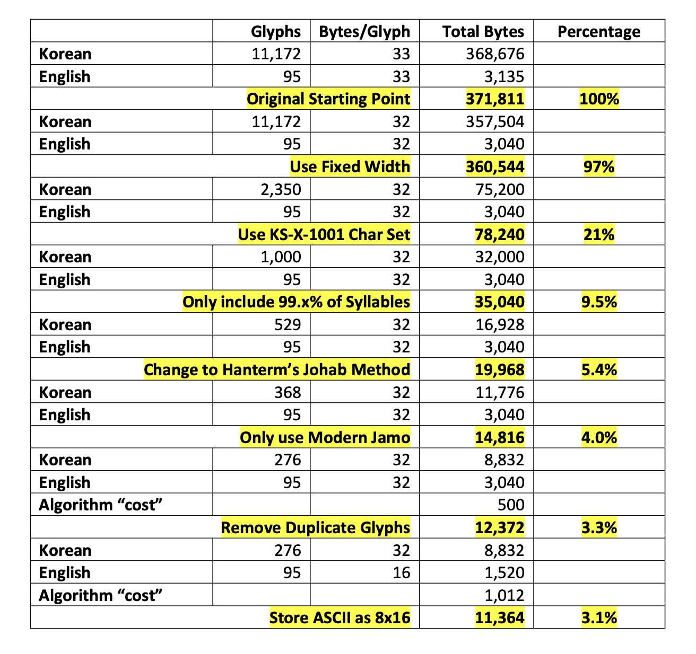

# Hangul OSD Fonts in the Embedded Microprocessor

Since in 1970, South Korea commemorates the founding of the Hangul
alphabet on the 9th of October, first introduced by King Sejong the
Great in 1446. To the casual observer, Korean text appears at first
glance to be a logographic system. But the symbols are not pictures, but
syllables, built from a basic alphabet of only 24 basic letters.
Typically a syllable is made using two, three, or four letters. 

Back ten-some years ago, I challenged myself to expand an On-Screen
Display (OSD) project to use Hangul in addition to the Latin alphabet.
There were several issues to solve, but the main showstopper was the
flash storage needed to hold the fonts. I was using an LPC1768 Cortex M3
MCU, which had at most 512 KiB of flash. In the 21st century, the
typical approach to displaying Hangul on a computer is to have one glyph
for each of the 11,172 syllables used in modern Korean text. This is
trivial on your PC, but a real challenge for an embedded system

As I researched this further, I went down a deep rabbit hole of glyphs,
graphemes, CJK internationalization, Unicode, Adobe's Bitmapped
Distribution Format (BDF), and obscure usenet threads about Hangul on
Sun workstations from the 1990s. The details are in the attached paper,
but here is the spoiler. I rediscovered a method called Johab
(compounding) which stores just the letters in a much smaller font
table, and combines the letters into syllables on the fly when a given
glyph is to be displayed. This tremendously reduces the font table size.
In my particular OSD system, a traditional font table storage for all
glyphs would have been 371,881 bytes. After applying the Johab technique
and a few additional optimizations, the font table is only 3.2% of that
-- 11,364 bytes.

